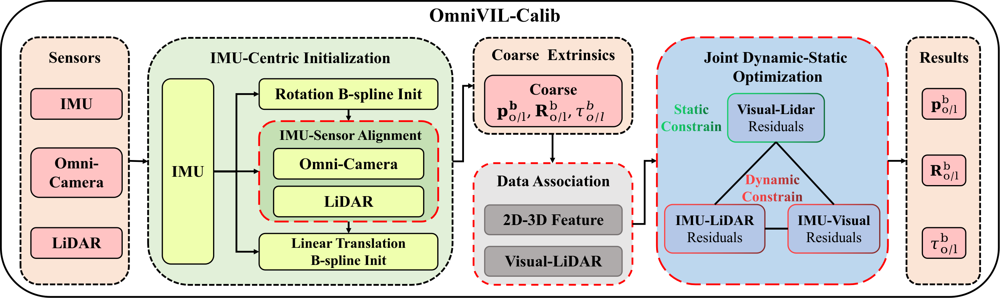
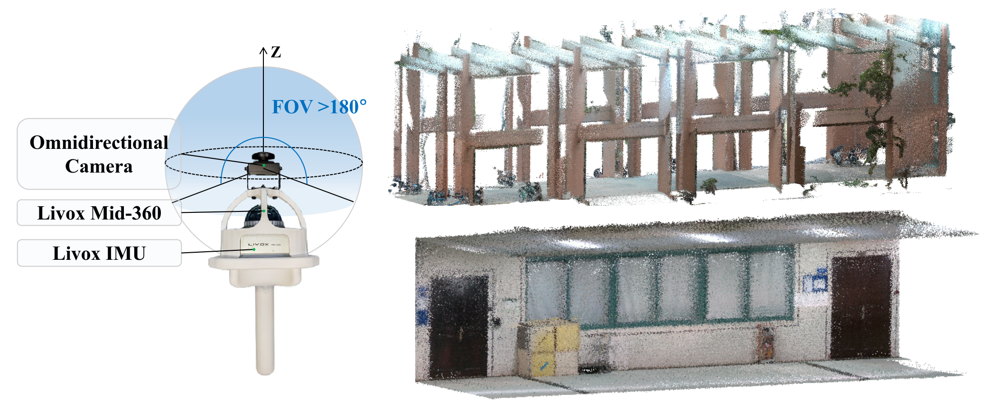

# OmniVIL-Calib: Target-Free Joint Calibration for Omnidirectional Camera, IMU, and LiDAR

<!-- [](你的论文链接)
[](你的个人/实验室主页) -->

This is the official implementation of **OmniVIL-Calib**, a target-free, mapping-free framework for joint spatiotemporal calibration of an omnidirectional VIL system.

## 🚀 News
- **[2026-01]** Our paper has been accepted by **IEEE Robotics and Automation Letters (RA-L)**!
- **[Ongoing]** We are currently cleaning up the code and organizing the *OmniVIL* dataset. Stay tuned!

## ✨ Key Features
- **Target-free:** Calibrate without checkerboards or specific targets.
- **Mapping-free:** No prior 3D maps or SfM subgraphs required.
- **Continuous-time Optimization:** Based on B-spline for asynchronous sensor fusion.
- **Omni-specific:** Specialized motion-flow model for FOV > 180°.

## 📊 Visualizations

<p align="center">
  
  <br>
  <em>(a) The proposed joint spatiotemporal calibration framework.</em>
</p>

<p align="center">
  
  <br>
  <em>(b) The experimental hardware platform and OmniVIL dataset scenarios.</em>
</p>

## 📂 OmniVIL Dataset
The self-collected dataset used in our paper will be released soon. It includes:
- Synchronized raw data from an omnidirectional camera, IMU, and LiDAR.
- Various indoor and outdoor complex scenarios.

## 📝 Citation
If you find this work useful, please cite:
```latex
@article{tu2026omnivil,
  title={OmniVIL-Calib: Target-Free Joint Calibration for Omnidirectional Camera, IMU, and LiDAR},
  author={Tu, YiHan and Mei, Ruidong and Cheng, Hui},
  journal={IEEE Robotics and Automation Letters},
  year={2026},
  publisher={IEEE}
}
```